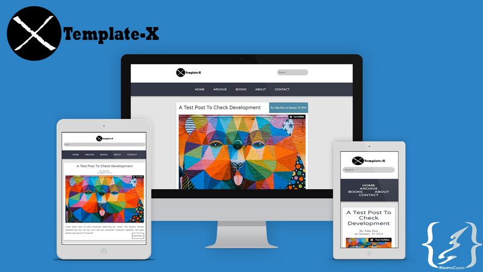

# template-x
A fully responsive, simple blog template built using responsive.gs

**Image Credit:** 
<a class="photo-credit" href="https://unsplash.com/@heftiba?utm_medium=referral&amp;utm_campaign=photographer-credit&amp;utm_content=creditBadge" target="_blank" rel="noopener noreferrer" title="Download free do whatever you want high-resolution photos from Toa Heftiba">
   Toa Heftiba
</a>

### Visual Presentation Mock-up:

   

### Description:
This is a fully responsive HTML/CSS template built using responsive.gs css grid framework. 
The template incorporates modern card layout with subtle shadows.

### Use Case:
This template can be used as the front-end for any blog that requires to be fully responsive supporting any screen size.

### Purpose of building this:
I built this to learn responsive.gs framework and formalize library.

### CSS Framework and Librariess Used:
1. Responsive.gs
2. Normalize.css
3. Formalize.css
